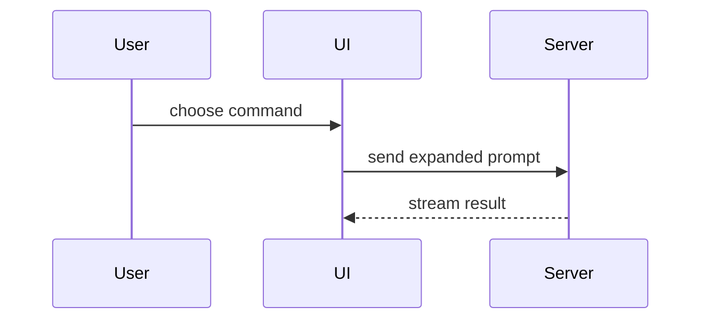

Help the user understand the current topic visually. Skip the preamble and keep prose brief. Pick the smallest view that makes the key point clear.

## Views

- Show logic or an algorithm as pseudocode:

```text
on(save)
  if content is unchanged
    return cached result
  write new content
  return fresh result
```

- Show runtime control flow as a call tree:

```text
submitForm
  createSession
    persistPrompt
    launchAgent
  navigateToSession
```

- Show UI structure as a component tree, including the state and module boundaries that matter:

```tsx
<SessionPage> (apps/example/src/routes/session.tsx)
  useSessionEvents()
  <SessionToolbar>
    <RunSkillButton> (packages/ui)
```

- Show file responsibility or a broad refactor as a shallow file tree:

```text
src/
├── commands/       # parses user actions
├── sessions/       # owns session state
└── transport/      # sends API requests
```

- Show component interaction, control flow, or data flow with Mermaid. Mermaid renders only in interfaces that support it; in a plain terminal,
  prefer a text tree.



- Show types and signatures when agreeing on the shape of code before writing it:

```ts
interface SkillResult {
  skillName: string;
  output: string;
}

function expandSkill(command: string): SkillResult;
```

## Changes

Use `diff` when the point is what changes and the surrounding shape already exists. Match the diff to the view.

For a component change:

```diff
 <SessionPage>
   useSessionEvents()
   <SessionToolbar>
+    <RunSkillButton />
   <SessionTimeline>
+    <SkillResultCard />
```

For a file-layout change:

```diff
 src/
 ├── commands/
+│   └── show-me.ts       # expands the slash command
 ├── sessions/
-└── transport.ts
+└── transport/
+    ├── client.ts
+    └── stream.ts
```

For a call-tree change:

```diff
 submitForm
   createSession
     persistPrompt
+    expandSkillMention
     launchAgent
-  navigateToSession
+  navigateToSession
+    subscribeToEvents
```

For a state or control-flow change:

```diff
 on(save)
-  write content
+  if content is unchanged
+    return cached result
+  write new content
+  invalidate cache
```

Show the whole block instead when most of it is new, when omitted context would hide ownership or order, or when the user needs a copyable target
shape.

## HTML

For a visual UI, layout, state comparison, or concept too dense for text and Mermaid, build one focused page with $html-artifacts: a diagram, an
infographic, or a short slide deck. Match the product's colors, type, spacing, and components, and use real labels and data.

## Guidance

- Place each visual next to the short text it supports.
- Keep only the calls, files, props, states, and boundaries needed to answer the current question or resolve the current discussion point.
- Use one view, or a few when each adds something. Never use every view.
